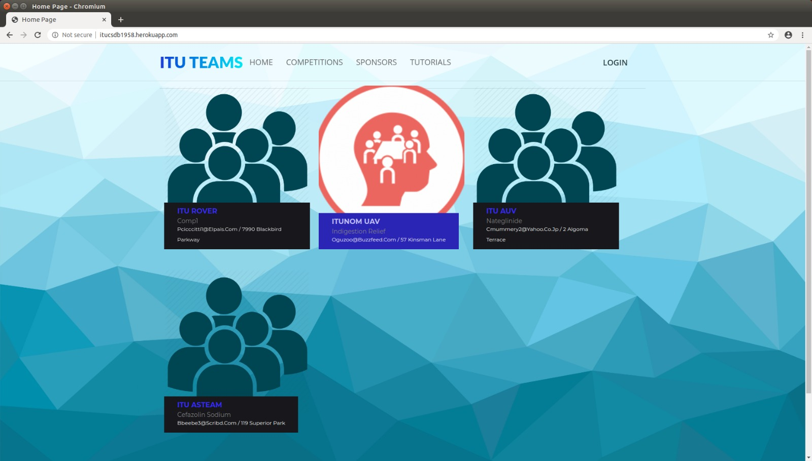
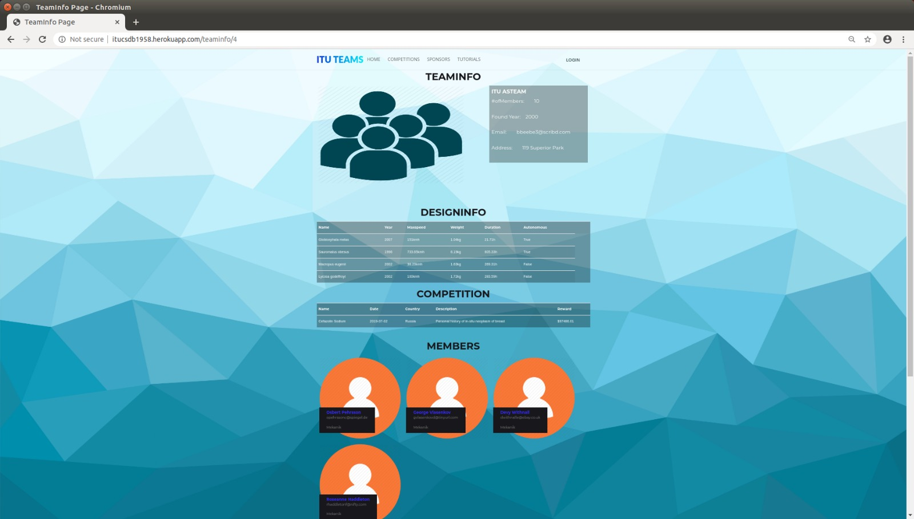
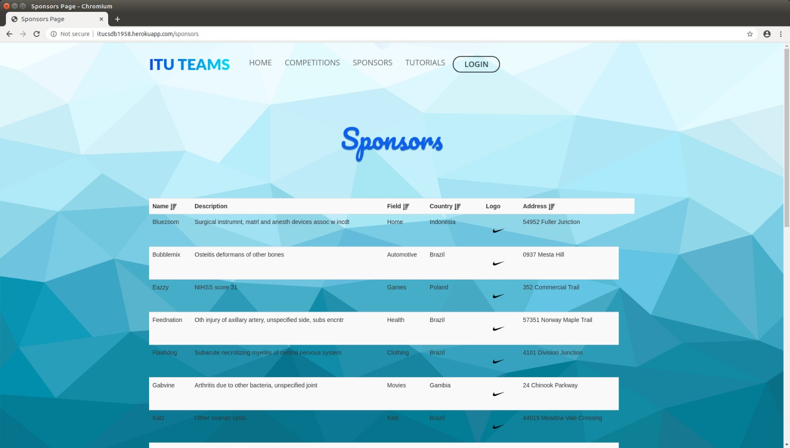
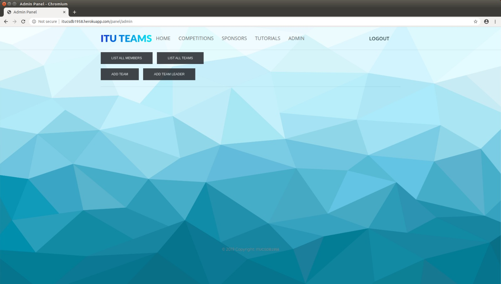

User Guide
==========

Welcome to ITUTEAMS user guide! This page will provide you with the necessary information to be able use our website to full extend.

* :ref:`Visitor`
* :ref:`Admin`
* :ref:`Team leader`
* :ref:`Subteam leader`
* :ref:`Member`

.. _Visitor:

Visitor
*************

.. note::
	You are able to navigate through our navigation bar buttons.

View teams and click on one of them to see the detailed information about the team.

	
	Teams/Home Page

View Team Details

	
	Team Info Page 

View Competitions, search by name, click on one of them to navigate to the competition website, if exists.

.. figure:: competitions.jpeg
	:scale: 40 %
	:alt: Competitions Page
	:align: center
	
	Competitions Page

View Sponsors and sort by table titles.

	
	Sponsors Page

.. _Team leader:

Team Leader
***************

You can perform every operation in this panel by clicking *Team Leader* on the navigation bar.

.. figure:: team_leader_panel.jpeg
	:scale: 40 %
	:alt: Team Leader Panel Page
	:align: center
	
	Team Leader Panel Page

.. _Subteam leader:

Subteam Leader
*****************

You can perform every operation in this panel by clicking *Subteam Leader* on the navigation bar.

.. figure:: subteam_leader_panel.jpeg
	:scale: 40 %
	:alt: Subteam Leader Panel Page
	:align: center
	
	Subteam Leader Panel Page

.. _Member:

Member
*************

You can perform every operation in this panel by clicking *MEMBER* on the navigation bar.

.. figure:: member_panel.jpeg
	:scale: 40 %
	:alt: Member Panel Page
	:align: center
	
	Member Panel Page

.. _Admin:

Admin
*************

You can perform every operation in this panel by clicking *ADMIN* on the navigation bar.

	
	Admin Panel Page

