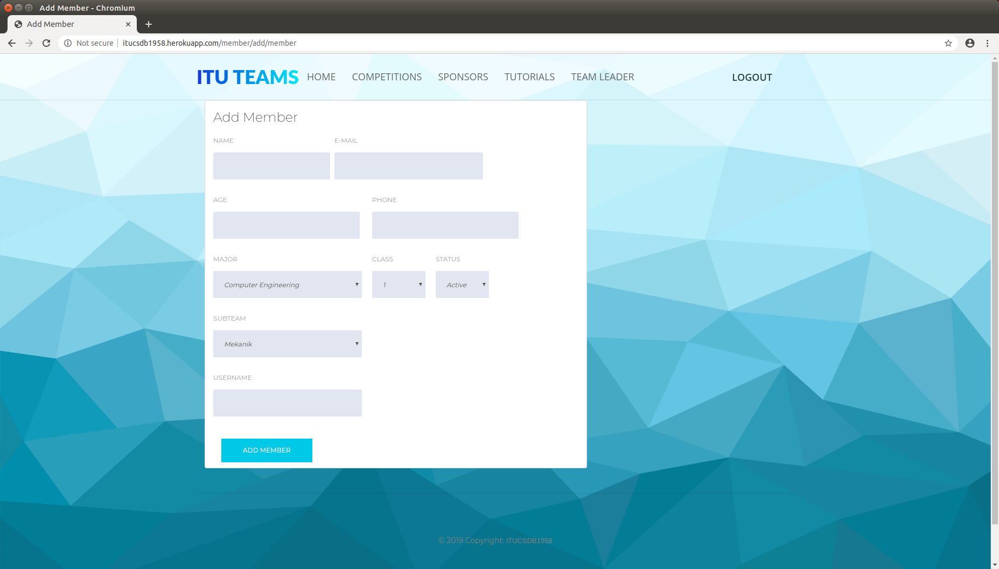
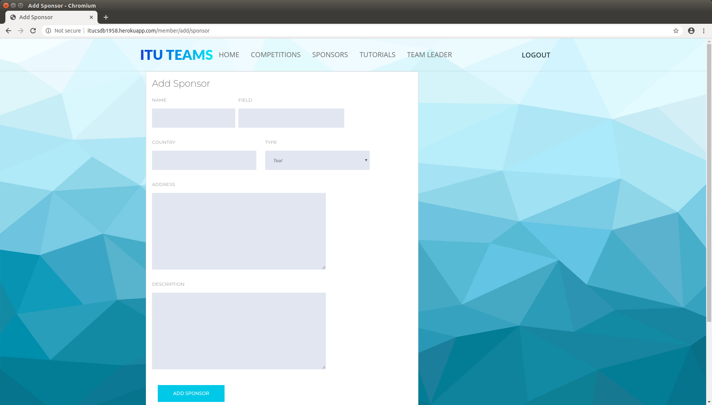
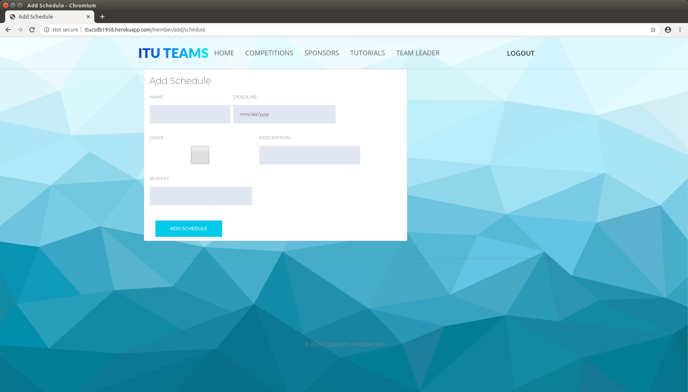
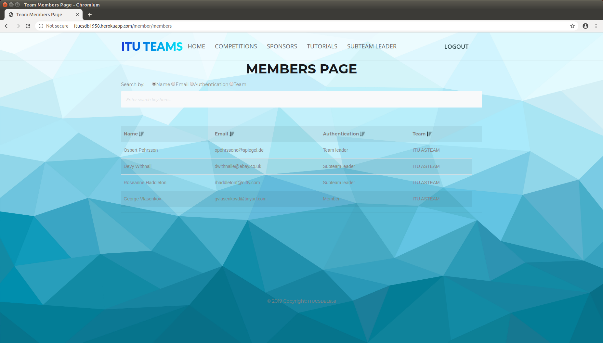
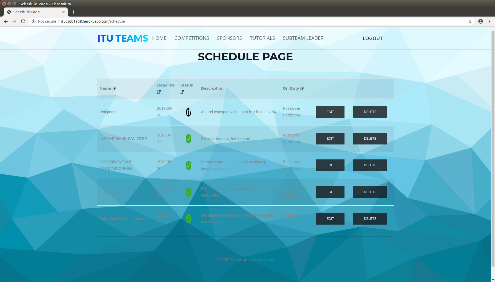
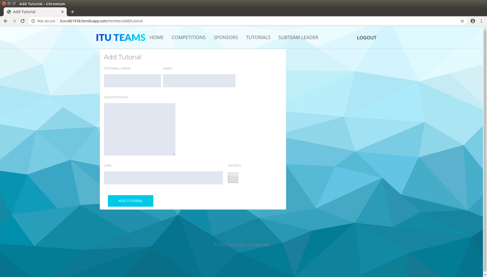
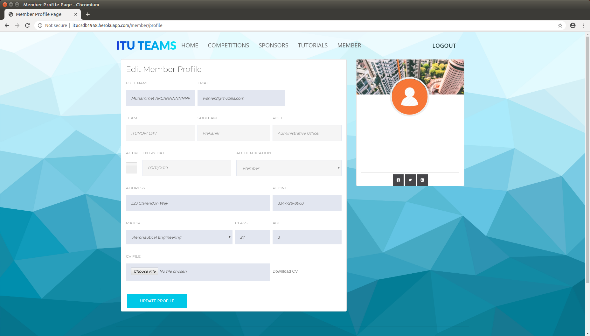
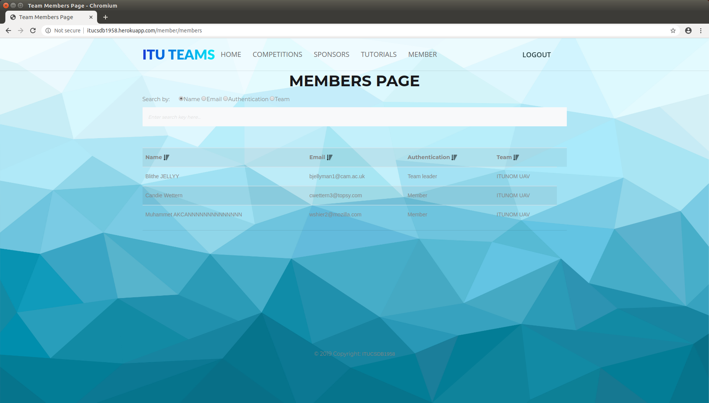
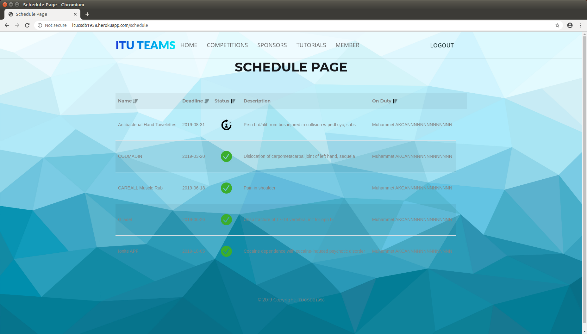
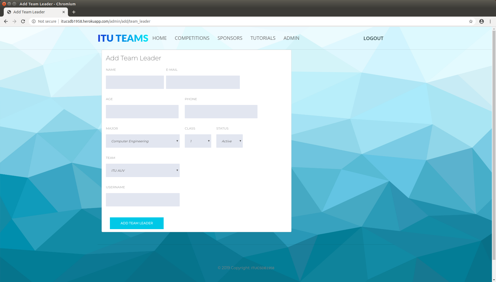

User Guide
==========

Welcome to ITUTEAMS user guide! This page will provide you with the necessary information to be able use our website to full extend.

* :ref:`Visitor`
* :ref:`Admin`
* :ref:`Team leader`
* :ref:`Subteam leader`
* :ref:`Member`

.. _Visitor:

Visitor
*************

.. note::
	You are able to navigate through our navigation bar buttons.

View teams and click on one of them to see the detailed information about the team.

.. figure:: teams_page.jpeg
	:scale: 40 %
	:alt: Teams Page
	:align: center
	
	Teams/Home Page

View Team Details

.. figure:: team_info.jpeg
	:scale: 40 %
	:alt: Team Info Page
	:align: center
	
	Team Info Page 

View Competitions, search by name, click on one of them to navigate to the competition website, if exists.

.. figure:: competitions.jpeg
	:scale: 40 %
	:alt: Competitions Page
	:align: center
	
	Competitions Page

View Sponsors and sort by table titles.

.. figure:: sponsors.jpeg
	:scale: 40 %
	:alt: Sponsors Page
	:align: center
	
	Sponsors Page

.. _Team leader:

Team Leader
***************

You can perform every operation in this panel by clicking *Team Leader* on the navigation bar.

.. figure:: team_leader_panel.jpeg
	:scale: 40 %
	:alt: Team Leader Panel Page
	:align: center
	
	Team Leader Panel Page

You can view your profile.

.. figure:: teamleader_profile.png
	:scale: 40 %
	:alt: Team Leader Panel Page
	:align: center
	
	Team Leader Profile

You can view your teams information.

.. figure:: teamleader_teaminfo.png
	:scale: 40 %
	:alt: Team Leader Panel Page
	:align: center
	
	Team Leader Team Info Page

You can perform every operation in this panel by clicking *Team Leader* on the navigation bar.

.. figure:: team_leader_panel.jpeg
	:scale: 40 %
	:alt: Team Leader Panel Page
	:align: center
	
	Team Leader Panel Page

You can list your team members

.. figure:: teamleader_list_members.png
	:scale: 40 %
	:alt: Team Leader Panel Page
	:align: center
	
	Team Leader Member List Page

You can list equipments

.. figure:: teamleader_list_equipments.png
	:scale: 40 %
	:alt: Team Leader Panel Page
	:align: center
	
	Team Leader Equipments Page

You can list your teams schedules.

.. figure:: teamleader_list_schedules.png
	:scale: 40 %
	:alt: Team Leader Panel Page
	:align: center
	
	Team Leader Schedules Page

You can add a new member.

	
	Team Leader Add Member Page

You can add sponsor.

	
	Team Leader Add Sponsor Page

You can add schedule.

	
	Team Leader Add Schedules Page

You can add tutorial.

.. figure:: teamleader_add_tutorial.png
	:scale: 40 %
	:alt: Team Leader Panel Page
	:align: center
	
	Team Leader Add Tutorial Page

You can add equipment.

.. figure:: teamleader_add_equipment.png
	:scale: 40 %
	:alt: Team Leader Panel Page
	:align: center
	
	Team Leader Add Equipment Page

You can add competition.

.. figure:: teamleader_add_competition.png
	:scale: 40 %
	:alt: Team Leader Panel Page
	:align: center
	
	Team Leader Add Competition Page

.. _Subteam leader:

Subteam Leader
*****************

You can perform every operation in this panel by clicking *Subteam Leader* on the navigation bar.

.. figure:: subteam_leader_panel.jpeg
	:scale: 40 %
	:alt: Subteam Leader Panel Page
	:align: center
	
	Subteam Leader Panel Page

You can view your profile

	
	Subteam Leader Profile Page

You can list team members

	
	Subteam Leader Members Page

You can list schedules

	
	Subteam Leader Schedules Page

You can list equipments

.. figure:: subteam_list_equipments.png
	:scale: 40 %
	:alt: Subteam Leader Panel Page
	:align: center
	
	Subteam Leader Equipments Page

You can add schedule.

.. figure:: subteam_add_schedule.png
	:scale: 40 %
	:alt: Subteam Leader Panel Page
	:align: center
	
	Subteam Leader Add Schedule Page

You can add tutorial.

	
	Subteam Leader Add tutorial Page

You can add equipment.

.. figure:: subteam_add_equipment.png
	:scale: 40 %
	:alt: Subteam Leader Panel Page
	:align: center
	
	Subteam Leader Add Equipment Page

.. _Member:

Member
*************

You can perform every operation in this panel by clicking *MEMBER* on the navigation bar.

.. figure:: member_panel.jpeg
	:scale: 40 %
	:alt: Member Panel Page
	:align: center
	
	Member Panel Page

You can view your profile

	
	Member Profile Page

You can list team members

	
	Member Team Members Page

You can list schedules

	
	Member List Schedules Page

You can list equipments

.. figure:: member_list_equipments.png
	:scale: 40 %
	:alt: Member Panel Page
	:align: center
	
	Member List Equipments Page

You can add tutorial

.. figure:: member_add_tutorial.png
	:scale: 40 %
	:alt: Member Panel Page
	:align: center
	
	Member Add Tutorial Page

.. _Admin:

Admin
*************

You can perform every operation in this panel by clicking *ADMIN* on the navigation bar.

.. figure:: admin_panel.jpeg
	:scale: 40 %
	:alt: Admin Panel Page
	:align: center
	
	Admin Panel Page

You can list teams

.. figure:: admin_list_teams.png
	:scale: 40 %
	:alt: Admin Panel Page
	:align: center
	
	Admin Teams Page

You can list members

.. figure:: admin_list_members.png
	:scale: 40 %
	:alt: Admin List Page
	:align: center
	
	Admin List Members Page

You can add team

.. figure:: admin_add_team.png
	:scale: 40 %
	:alt: Admin Panel Page
	:align: center
	
	Admin Add Team Page

You can add team leader

	
	Admin Add Team Leader Page
